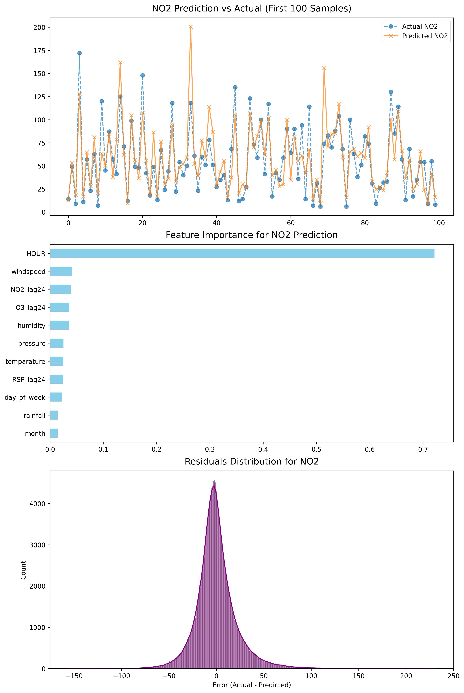

## Introduction 
dataset : https://www.kaggle.com/datasets/act18l/hongkongrainfall & https://www.kaggle.com/datasets/samsonlo/hong-kong-air-quality-data-201019

Joint two dataset to predict air quality

Stack: sklearn
## Features: 

- datetime: hour, month, day_of_week
- weather: temparature, windspeed, pressure, humidity, rainfall
- advance feature: NO2_lag24, RSP_lag24, O3_lag24

## Data cleaning:
merge data on "DATE"
clean null or dirty data

## Result



## Note 

1. preprocessor 

preprocess data, based on data type: num / cat data

```python

preprocessor = ColumnTransformer(
    transformers=[
        #(name, encoder/ scaler, data group )
        ('num', StandardScaler(), [
            'temparature', 'windspeed', 'rainfall', 'pressure', 'humidity',
            'NO2_lag24', 'RSP_lag24', 'O3_lag24'
        ]),
        ('cat', 'passthrough', ['HOUR', 'month', 'day_of_week'])
    ]
)

```

Process(handle_unknown='ignore')：

- StandardScaler() 
- MinMaxScaler() 
- RobustScaler() # outliners 
- KBinsDiscretizer() 

- OneHotEncoder()
- OrdinalEncoder()

- SimpleImputer( strategy='mean/ median/ ...')

When transfering datatype, ['name'] / [index] / [True, False (Mask)] / Function 

2. pipeline

```python
Pipeline(steps, *, memory=None, verbose=False)
```

deinfine how the pipeline work, inculde preprocess and regression 

```python

model_pipeline = Pipeline(
    steps=[
        ('preprocessor', preprocessor),
        ('regressor', MultiOutputRegressor(XGBRegressor(n_estimators=100, random_state=42)))
    ])

pipeline = Pipeline(
    steps=[
        ('scaler', StandardScaler()),
        ('selector', SelectKBest(score_func=f_regression, k=50)),
        ('pca', PCA(n_components=10)),
        ('model', XGBRegressor(n_estimators=200))
    ]
)

pipeline = make_pipeline(StandardScaler(), XGBRegressor())

pipeline.fit(X_train, y_train)

```
Pipeline + preprocess

```python 
num_transformer = Pipeline(steps=[
    ('imputer', SimpleImputer(strategy='median')), 
    ('scaler', StandardScaler())                   
])

preprocessor = ColumnTransformer(
    transformers=[
        ('num_pipe', num_transformer, num_features)
    ])
```
